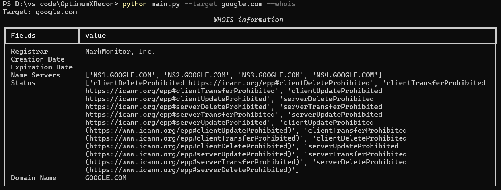
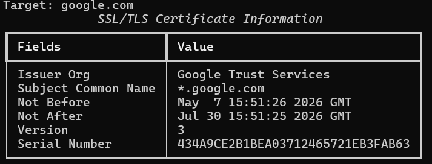
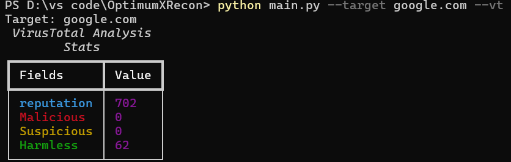
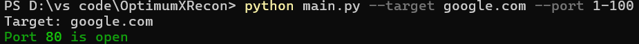
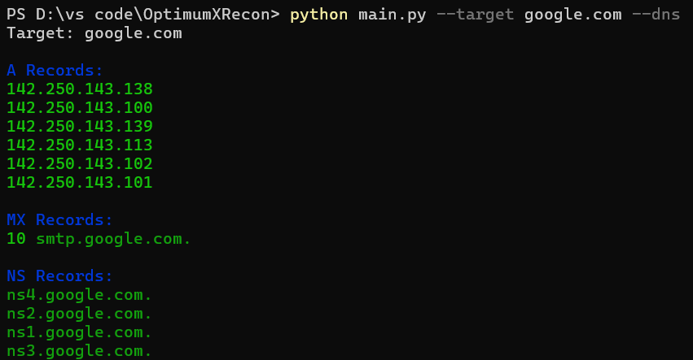

# OptimumXRecon

A modular cybersecurity reconnaissance toolkit written in Python.

OptimumXRecon helps security enthusiasts, students, and researchers gather information about domains, websites, and network services through multiple reconnaissance modules integrated into a single command-line tool.

---

## Features

### Network Reconnaissance

* DNS Lookup
* Threaded Port Scanner
* SSL Certificate Analysis

### Web Security Analysis

* Security Header Analysis
* Technology Fingerprinting

### OSINT & Intelligence Gathering

* WHOIS Lookup
* Subdomain Enumeration
* VirusTotal Reputation Analysis

### Reporting

* Professional Dark-Mode HTML Report
* Executive Summary with Color-Coded Badges
* Print-Friendly Output

### User Experience

* Rich Console Interface
* Colored Output
* Structured Tables
* Full Scan Mode (all modules at once)

---

## Screenshots

### WHOIS Lookup



### SSL Certificate Analysis



### VirusTotal Analysis



### Port Scanner



### DNS Lookup



---

## Project Structure

```text
OptimumXRecon/
├── core/
│   ├── dns_lookup.py
│   ├── port_scanner.py
│   ├── ssl_checker.py
│   ├── whois_lookup.py
│   ├── header_analyzer.py
│   ├── tech_fingerprint.py
│   ├── subdomain_enum.py
│   ├── virustotal_lookup.py
│   └── full_scan.py
│
├── utils/
│   ├── console.py
│   ├── config.py
│   └── validators.py
│
├── reports/
│   ├── html_reports.py
│   └── templates/
│       └── report.html
│
├── screenshots/
│   ├── dns.png
│   ├── port.png
│   ├── ssl.png
│   ├── vt.png
│   └── whois.png
│
├── output/
│   └── reports/
│
├── .env.example
├── requirements.txt
├── changelog.md
├── README.md
└── main.py
```

---

## Installation

### Clone Repository

```bash
git clone https://github.com/OpTiMuS-mov/OptimumXRecon.git
cd OptimumXRecon
```

### Create Virtual Environment

```bash
python -m venv venv
```

### Activate Virtual Environment

Windows:

```bash
venv\Scripts\activate
```

Linux/macOS:

```bash
source venv/bin/activate
```

### Install Dependencies

```bash
pip install -r requirements.txt
```

---

## VirusTotal Setup

Create a `.env` file in the project root:

```env
VT_API_KEY=YOUR_VIRUSTOTAL_API_KEY
```

You can obtain a free API key from VirusTotal.

---

## Usage Examples

### DNS Lookup

```bash
python main.py --target google.com --dns
```

### Port Scanning

```bash
python main.py --target scanme.nmap.org --ports 1-100
```

### WHOIS Lookup

```bash
python main.py --target google.com --whois
```

### SSL Certificate Analysis

```bash
python main.py --target google.com --ssl
```

### Security Header Analysis

```bash
python main.py --target https://google.com --headers
```

### Technology Fingerprinting

```bash
python main.py --target https://google.com --tech
```

### Subdomain Enumeration

```bash
python main.py --target google.com --subdomains
```

### VirusTotal Analysis

```bash
python main.py --target google.com --vt
```

### Generate HTML Report

Run any scan and generate a report:

```bash
python main.py --target google.com --dns --ssl --whois --report
```

### Full Scan

Run all modules at once:

```bash
python main.py --target google.com --full
```

### Full Scan with Report

```bash
python main.py --target google.com --full --report
```

---

## CLI Arguments

| Argument | Type | Description |
|----------|------|-------------|
| `--target` | string | Target domain, IP, or URL |
| `--dns` | flag | Run DNS lookup |
| `--ports` | string | Scan ports (e.g. `80` or `1-1000`) |
| `--whois` | flag | Run WHOIS lookup |
| `--ssl` | flag | Run SSL/TLS check |
| `--headers` | flag | Run HTTP header analysis |
| `--tech` | flag | Run technology fingerprinting |
| `--subdomains` | flag | Run subdomain enumeration |
| `--vt` | flag | Run VirusTotal lookup |
| `--report` | flag | Generate HTML report |
| `--full` | flag | Run all scans at once |

---

## Technologies Used

* Python
* Socket Programming
* Requests
* Rich
* Jinja2
* dnspython
* python-whois
* python-dotenv
* VirusTotal API

---

## Changelog

### v1.1

* HTML Report Generation (`--report`)
* Full Scan Mode (`--full`)
* Professional dark-mode report with cybersecurity theme
* Executive summary cards with color-coded badges
* XSS protection via Jinja2 autoescape
* Port scanner input validation
* Bug fixes and code improvements

### v1.0

* DNS Lookup
* Threaded Port Scanner
* WHOIS Lookup
* SSL Analysis
* Security Header Analysis
* Technology Fingerprinting
* Subdomain Enumeration
* VirusTotal Integration
* Rich CLI Interface

---

## Future Improvements

* Banner Grabbing
* SQLite Scan History
* JSON Export
* Advanced Subdomain Enumeration
* Additional Threat Intelligence Integrations

---

## Disclaimer

This tool is intended for educational purposes and authorized security testing only.

Always obtain proper authorization before scanning systems you do not own.

---

## Author

**Avinash Kotarya**

Cybersecurity Student | Python Developer | Security Enthusiast

GitHub: https://github.com/OpTiMuS-mov
